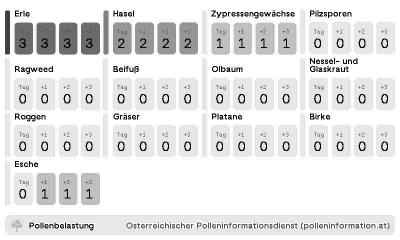

# TRMNL Pollen Information Austria

A TRMNL plug-in that displays current pollen levels for Austria using data from the Österreichischer Polleninformationsdienst. Shows today's pollen contamination and a 3-day forecast per pollen type, with optional filtering by pollen name.

## Credits
Data provided by Österreichischer Polleninformationsdienst, <a href="https://www.polleninformation.at" target="_blank">www.polleninformation.at</a>
