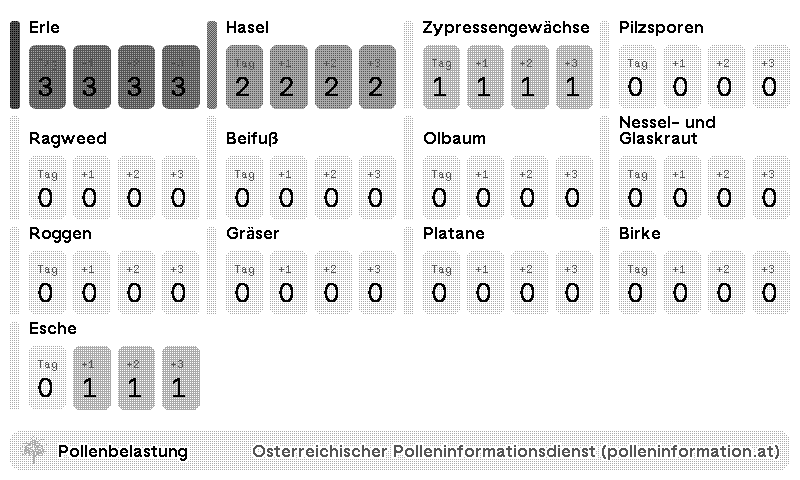

# TRMNL Pollen Information Austria



A TRMNL plug-in that displays current pollen levels for Austria using data from the Österreichischer Polleninformationsdienst. Shows today's pollen contamination and a 3-day forecast per pollen type, with optional filtering by pollen name.

<a href="https://trmnl.com/recipes/255979">
  
</a>

## Settings

- **API Key** — free key from the Austrian Pollen Information Service (request one via the link in the plugin's About section). Fair use: please don't poll more than once every 4 hours.
- **Country** / **Language** — location and language for pollen names. `Language` also switches the plugin's own UI text between German and English; all other languages fall back to German UI text.
- **Latitude** / **Longitude** — your location, e.g. via [latlong.net](https://www.latlong.net).
- **Minimum Severity** — hide pollen types below a chosen contamination level (default: hide zero-contamination entries).
- **Pollen Filter** (optional) — comma-separated pollen names to show only those types; partial matches supported.

## Development

Requires a non-system Ruby (macOS ships Ruby 2.6, too old for `trmnlp`):

```sh
export PATH="/opt/homebrew/opt/ruby/bin:$PATH"
trmnlp serve      # http://localhost:4567
trmnlp lint       # same gate as CI
trmnlp build --png
```

Local custom-field presets live in `.trmnlp.yml`. The API key comes from the `POLLEN_API_KEY`
environment variable; set `POLLEN_LATITUDE`/`POLLEN_LONGITUDE` the same way to preview with your
own location without committing it — the checked-in defaults are a public landmark, not a real
address.

## Credits
Data provided by Österreichischer Polleninformationsdienst, <a href="https://www.polleninformation.at" target="_blank">www.polleninformation.at</a>
